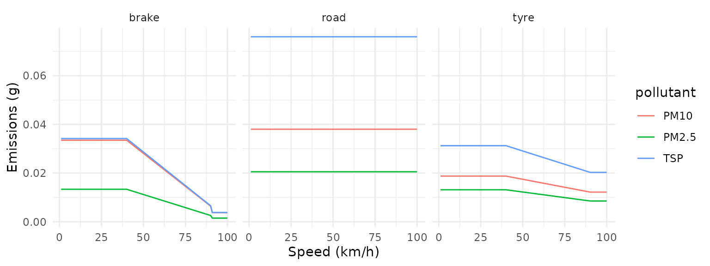
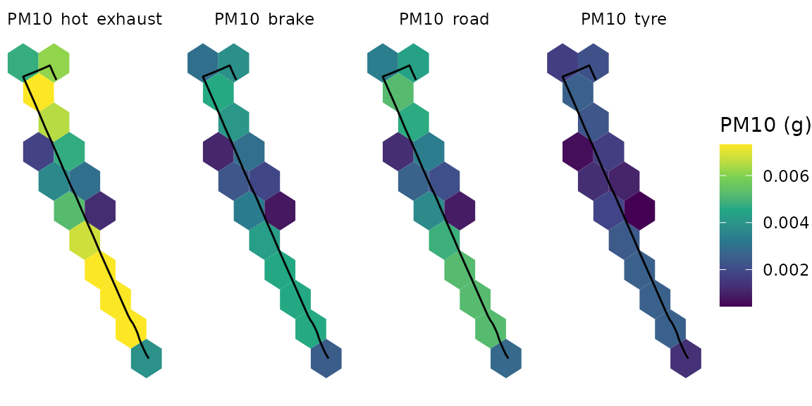
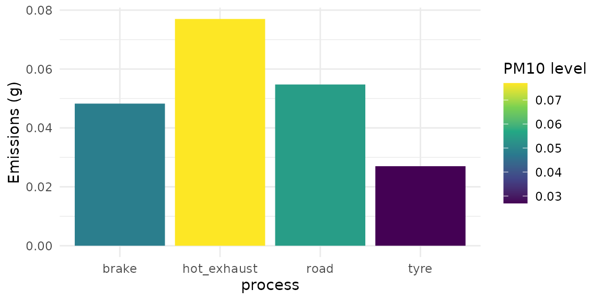

# Exploring Non-Exhaust Emission Factors

When assessing vehicle emissions inventories for particles, one relevant
step is taking into account the non-exhaust processes, such as tire,
brake and road wear. The `gtfs2emis` incorporates the non-exhaust
emissions methods from
[EMEP-EEA](https://www.eea.europa.eu//publications/emep-eea-guidebook-2019).

The following equation is employed to evaluate emissions originating
from tire and brake wear

$$TE_{i} = dist \times EF_{tsp}(j) \times mf_{s}(i) \times SC(speed)$$
where:

- $TE(i)$ = total emissions of pollutant $i$ (g),
- $dist$ = distance driven by each vehicle (km),
- $EF_{tsp}(j)$ = TSP (Total Suspended Particle) mass emission factor
  for vehicles of category $j$ (g/km),
- $mf_{s}(i)$ = mass fraction of TSP that can be attributed to pollutant
  $i$,
- $SC(speed)$ = correction factor for a mean vehicle travelling at a
  given speed (-).

## Tire

In the case of heavy-duty vehicles, the emission factor needs the
incorporation of vehicle size, as determined by the number of axles, and
load. These parameters are introduced into the equation as follows:

$$EFTSP_{tire}^{hdv} = 0.5 \times N_{axle} \times LCF_{tire} \times EFTSP_{tire}^{pc}$$

where:

- $EFTSP_{tire}^{hdv}$ = TSP emission factor for tire wear from
  heavy-duty vehicles (g/km),
- $N_{axle}$ = number of vehicle axles (-),
- $LCF_{tire}$ = a load correction factor for tire wear (-),
- $EFTSP_{tire}^{pc}$ = TSP emission factor for tire wear from passenger
  car vehicles (g/km).

and $$LCF_{tire} = 1.41 + (1.38 \times LF)$$

where:

- $LF$ = load factor (-), ranging from 0 for an empty bus to 1 for a
  fully laden one.

The function considers the following look-up table for number of vehicle
axes:

| vehicle class (j)    | number of axes |
|----------------------|----------------|
| Ubus Midi \<=15 t    | 2              |
| Ubus Std 15 - 18 t   | 2              |
| Ubus Artic \>18 t    | 3              |
| Coaches Std \<=18 t  | 2              |
| Coaches Artic \>18 t | 3              |

The size distribution of tire wear particles are given by:

| particle size class (i) | mass fraction of TSP |
|-------------------------|----------------------|
| TSP                     | 1.000                |
| PM10                    | 0.600                |
| PM2.5                   | 0.420                |
| PM1.0                   | 0.060                |
| PM0.1                   | 0.048                |

Finally, the speed correction is:

- $SC_{tire}(speed) = 1.39$, when $speed < 40km/h$;
- $SC_{tire}(speed) = - 0.00974 \times speed + 1.78$, when
  $40 < = speed < = 90km/h$;
- $SC_{tire}(speed) = 0.902$, when $speed > 90km/h$.

``` r
library(gtfs2emis)
emi_europe_emep_wear(dist = units::set_units(1,"km"),
                              speed =  units::set_units(30,"km/h"),
                              pollutant = c("PM10","TSP","PM2.5"),
                              veh_type = "Ubus Std 15 - 18 t",
                              fleet_composition = 1,
                              load = 0.5,
                              process = c("tyre"),
                              as_list = TRUE)
#> $pollutant
#> [1] "PM10"  "TSP"   "PM2.5"
#> 
#> $veh_type
#> [1] "Ubus Std 15 - 18 t"
#> 
#> $fleet_composition
#> [1] 1
#> 
#> $speed
#> 30 [km/h]
#> 
#> $dist
#> 1 [km]
#> 
#> $emi
#>    PM10_tyre_veh_1 TSP_tyre_veh_1 PM2.5_tyre_veh_1
#>            <units>        <units>          <units>
#> 1:  0.01873998 [g]  0.0312333 [g]   0.01311799 [g]
#> 
#> $process
#> [1] "tyre"
```

## Brake

The heavy-duty vehicle emission factor is derived by modifying the
passenger car emission factor to conform to experimental data obtained
from heavy-duty vehicles.

$$EFTSP_{brake}^{hdv} = 1.956 \times LCF_{brake} \times EFTSP_{brake}^{pc}$$

where:

- $EFTSP_{brake}^{hdv}$ = heavy-duty vehicle emission factor for TSP,
- $LCF_{brake}$ = load correction factor for brake wear,
- $EFTSP_{brake}^{pc}$ = passenger car emission factor for TSP.

$$LCF_{brake} = 1 + (0.79 \times LF),$$

where:

- $LF$ = load factor (-), ranging from 0 for an empty bus to 1 for a
  fully laden one.

The size distribution of brake wear particles are given by:

| particle size class (i) | mass fraction of TSP |
|-------------------------|----------------------|
| TSP                     | 1.000                |
| PM10                    | 0.980                |
| PM2.5                   | 0.390                |
| PM1.0                   | 0.100                |
| PM0.1                   | 0.080                |

Finally, the speed correction is:

- $SC_{brake}(speed) = 1.67$, when $speed < 40km/h$;
- $SC_{brake}(speed) = - 0.0270 \times speed + 2.75$, when
  $40 < = speed < = 95km/h$;
- $SC_{brake}(speed) = 0.185$, when $speed > 95km/h$.

``` r
emi_europe_emep_wear(dist = units::set_units(1,"km"),
                              speed =  units::set_units(30,"km/h"),
                              pollutant = c("PM10","TSP","PM2.5"),
                              veh_type = "Ubus Std 15 - 18 t",
                              fleet_composition = 1,
                              load = 0.5,
                              process = c("brake"),
                              as_list = TRUE)
#> $pollutant
#> [1] "PM10"  "TSP"   "PM2.5"
#> 
#> $veh_type
#> [1] "Ubus Std 15 - 18 t"
#> 
#> $fleet_composition
#> [1] 1
#> 
#> $speed
#> 30 [km/h]
#> 
#> $dist
#> 1 [km]
#> 
#> $emi
#>    PM10_brake_veh_1 TSP_brake_veh_1 PM2.5_brake_veh_1
#>             <units>         <units>           <units>
#> 1:   0.03349245 [g]  0.03417597 [g]    0.01332863 [g]
#> 
#> $process
#> [1] "brake"
```

## Road Wear

Emissions are calculated according to the equation:

$$TE(i) = dist \times EF_{tsp}^{road}(j) \times mf_{road}$$

where:

- $TE(i)$ = total emissions of pollutant i (g),
- $dist$ = total distance driven by vehicles in category j (km),
- $EF_{tsp}^{road}$ = TSP mass emission factor from road wear for
  vehicles j (0.0760 g/km),
- $mf_{road}$ = mass fraction of TSP that can be attributed to particle
  size class i (-).

The following table shows the size distribution of road surface wear
particles

| particle size class (i) | mass fraction of TSP |
|-------------------------|----------------------|
| TSP                     | 1.00                 |
| PM10                    | 0.50                 |
| PM2.5                   | 0.27                 |

``` r
emi_europe_emep_wear(dist = units::set_units(1,"km"),
                              speed =  units::set_units(30,"km/h"),
                              pollutant = c("PM10","TSP","PM2.5"),
                              veh_type = "Ubus Std 15 - 18 t",
                              fleet_composition = 1,
                              load = 0.5,
                              process = c("road"),
                              as_list = TRUE)
#> $pollutant
#> [1] "PM10"  "TSP"   "PM2.5"
#> 
#> $veh_type
#> [1] "Ubus Std 15 - 18 t"
#> 
#> $fleet_composition
#> [1] 1
#> 
#> $speed
#> 30 [km/h]
#> 
#> $dist
#> 1 [km]
#> 
#> $emi
#>    PM10_road_veh_1 TSP_road_veh_1 PM2.5_road_veh_1
#>            <units>        <units>          <units>
#> 1:       0.038 [g]      0.076 [g]      0.02052 [g]
#> 
#> $process
#> [1] "road"
```

## Viewing Emissions

Users can also use one single function to apply for more than one
process (e.g. tire, brake and road), as shown below.

``` r
library(units)
library(ggplot2)

emis_list <- emi_europe_emep_wear(dist = units::set_units(rep(1,100),"km"),
                     speed =  units::set_units(1:100,"km/h"),
                     pollutant = c("PM10","TSP","PM2.5"),
                     veh_type = c("Ubus Std 15 - 18 t"),
                     fleet_composition = c(1),
                     load = 0.5,
                     process = c("brake","tyre","road"),
                     as_list = TRUE)
ef_dt <- gtfs2emis::emis_to_dt(emis_list,emi_vars = "emi"
                               ,segment_vars = "speed")
ggplot(ef_dt)+
  geom_line(aes(x = as.numeric(speed),y = as.numeric(emi),color = pollutant))+
  facet_wrap(facets = vars(process))+
  labs(x = "Speed (km/h)",y = "Emissions (g)")+
  theme_minimal()
```



When using the
[`transport_model()`](https://ipeagit.github.io/gtfs2emis/reference/transport_model.md)
output, users can also visualize both hot-exhaust and non-exhaust
emissions taking few more steps. This can be done in three main stages:
a) Preparing the data, b) Creating spatial grid; c) Generating spatial
and temporal visualizations.

### a) Preparing the data

``` r
library(gtfstools)
library(sf)

# read GTFS
gtfs_file <- system.file("extdata/bra_cur_gtfs.zip", package = "gtfs2emis")
gtfs <- gtfstools::read_gtfs(gtfs_file) 

# keep a single trip_id to speed up this example
gtfs_small <- gtfstools::filter_by_trip_id(gtfs, trip_id ="4451136")

# run transport model
tp_model <- transport_model(gtfs_data = gtfs_small,
                            spatial_resolution = 100,
                            parallel = FALSE)

# Fleet data, using Brazilian emission model and fleet
fleet_data_ef_emep <- data.frame(veh_type = "Ubus Std 15 - 18 t",
                                 fleet_composition = 1,
                                 euro = "V",   # for hot-exhaust emissions 
                                 fuel = "D",   # for hot-exhaust emissions 
                                 tech = "SCR") # for hot-exhaust emissions 
# Emission model (hot-exhaust)
emi_list_he <- emission_model(
  tp_model = tp_model,
  ef_model = "ef_europe_emep",
  fleet_data = fleet_data_ef_emep,
  pollutant = "PM10"
)

# Emission model (non-exhaust)
emi_list_ne <- emi_europe_emep_wear(
  dist = tp_model$dist,
  speed = tp_model$speed,
  pollutant = "PM10",
  veh_type = c("Ubus Std 15 - 18 t"),
  fleet_composition = c(1),
  load = 0.5,
  process = c("brake","tyre","road"),
  as_list = TRUE)

emi_list_ne$tp_model <- tp_model
```

### b) Creating spatial grid

``` r
# create spatial grid
grid <- sf::st_make_grid(
  x = sf::st_make_valid(tp_model)
  , cellsize = 0.25 / 200
  , crs= 4326
  , what = "polygons"
  , square = FALSE
)

# grid (hot-exhaust)
emi_grid_he <- emis_grid( emi_list_he,grid,time_resolution = 'day'
                          ,aggregate = TRUE)
setDT(emi_grid_he)
pol_names <- setdiff(names(emi_grid_he),"geometry")
emi_grid_he_dt <- melt(emi_grid_he,measure.vars = pol_names,id.vars = "geometry")
emi_grid_he_dt <- sf::st_as_sf(emi_grid_he_dt)

# grid (non-exhaust)
emi_grid_ne <- emis_grid( emi_list_ne,grid,time_resolution = 'day'
                       ,aggregate = TRUE)
setDT(emi_grid_ne)
pol_names <- setdiff(names(emi_grid_ne),"geometry")
emi_grid_ne_dt <- melt(emi_grid_ne,measure.vars = pol_names,id.vars = "geometry")
emi_grid_ne_dt <- sf::st_as_sf(emi_grid_ne_dt)

# bind grid
emi_grid_dt <- data.table::rbindlist(l = list(emi_grid_he_dt,emi_grid_ne_dt))
emi_grid_sf  <- sf::st_as_sf(emi_grid_dt)
```

### c) Generating spatial and temporal patterns

``` r
# plot
library(ggplot2)

ggplot(emi_grid_sf) +
  geom_sf(aes(fill= as.numeric(value)), color=NA) +
  geom_sf(data = tp_model$geometry,color = "black")+
  scale_fill_continuous(type = "viridis")+
  labs(fill = "PM10 (g)")+
  facet_wrap(facets = vars(variable),nrow = 1)+
  theme_void()
```



The total emissions can be also viewed in bar graphics

``` r
# Emissions by time
emi_time_he <- emis_summary(emi_list_he,by = "time")
emi_time_ne <- emis_summary(emi_list_ne,by = "time")

emi_time <- data.table::rbindlist(l = list(emi_time_he,emi_time_ne))

ggplot(emi_time)+
  geom_col(aes(x = process,y = as.numeric(emi),fill = as.numeric(emi)))+
  scale_fill_continuous(type = "viridis")+
  labs(fill = "PM10 level",y = "Emissions (g)")+
  theme_minimal()
```



## References

EMEP/EEA data and reports can be accessed in the following links:

- 2019 edition
  [EMEP-EEA](https://www.eea.europa.eu//publications/emep-eea-guidebook-2019).

## Report a bug

If you have any suggestions or want to report an error, please visit
[the package GitHub page](https://github.com/ipeaGIT/gtfs2emis/issues).
