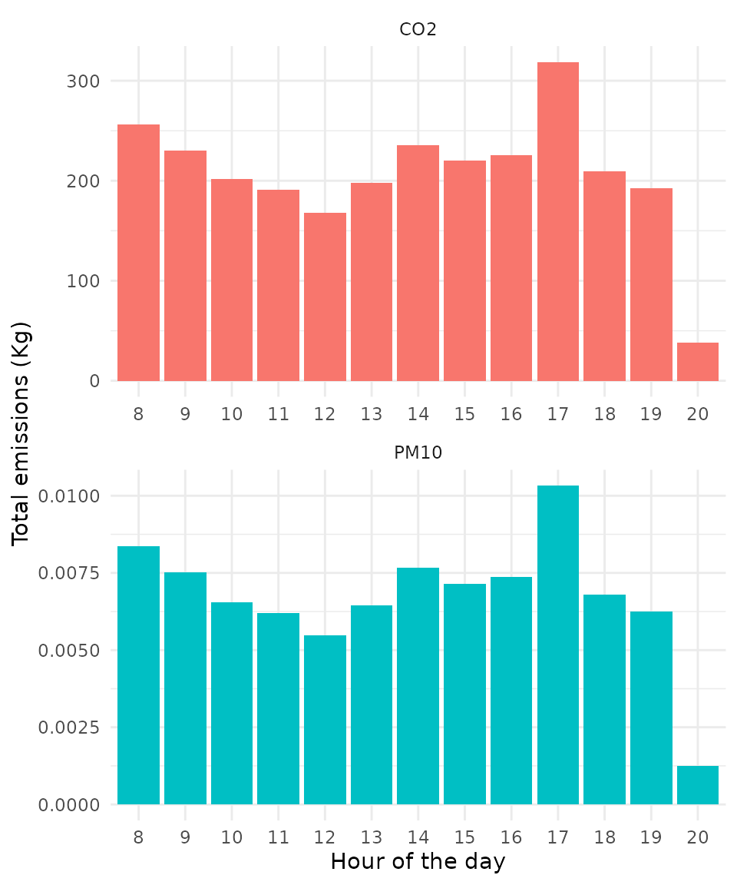
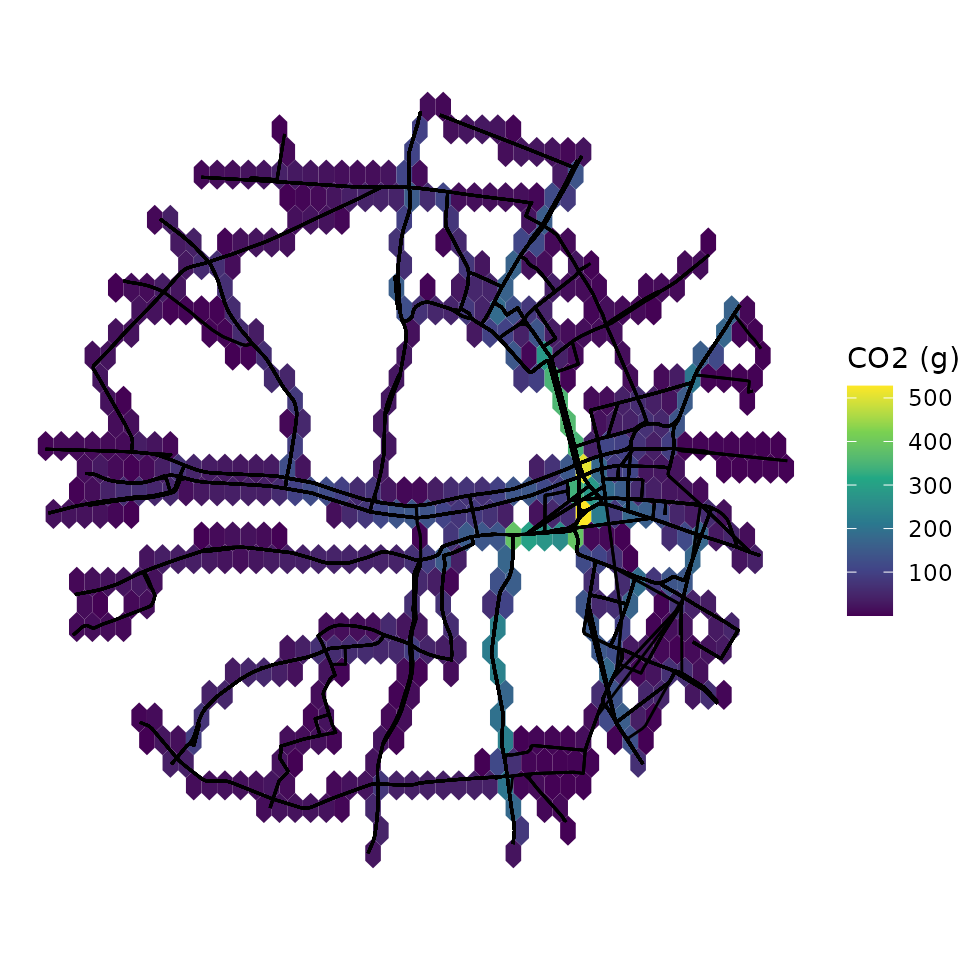

# Getting started

Abstract

`gtfs2emis` is an R package to estimate public transport emissions using
data in the General Transit Feed Specification (GTFS) format. The
package allows users to estimate the emission levels of several types of
pollutants for each public transport vehicle/trip/route at high spatial
and temporal resolutions simply using a GTFS feed and some information
on fleet characteristics.

## 1. Introduction

`gtfs2emis` is an R package to estimate hot exhaust emissions of public
transport vehicles using data in the General Transit Feed Specification
(GTFS) format. The package allows users to estimate the emission levels
of several types of pollutants for each public transport
vehicle/trip/route at high spatial and temporal resolutions simply using
a GTFS feed and some information on fleet characteristics. This vignette
introduces the main functions of the `gtfs2emis` package and shows a
step-by-step reproducible example of how to use the package.

## 2. Installation

One can install the development version `gtfs2emis` from Github:

``` r
library(devtools)
# From CRAN
install.packages("gtfs2emis")

# Dev. version with latest features
# install.packages("remotes")
remotes::install_github("ipeaGIT/gtfs2emis")
```

A few samples of GTFS and fleet files are included in the package:

``` r
data_path <- system.file("extdata", package = "gtfs2emis")
list.files(data_path)
#> [1] "bra_cur_fleet.txt" "bra_cur_gtfs.zip"  "bra_cur-srtm.tif" 
#> [4] "irl_dub_fleet.txt" "irl_dub_gtfs.zip"  "usa_det_fleet.txt"
#> [7] "usa_det_gtfs.zip"
```

- Subset of Curitiba (Brazil): `bra_cur_gtfs.zip` and
  `bra_cur_fleet.txt`
- Subset of Dublin (Ireland): `irl_dub_gtfs.zip` and `irl_dub_fleet.txt`
- Subset of Detroit (US): `usa_det_gtfs.zip` and `usa_det_fleet.txt`

## 3. Data requirements

To estimate the emission levels from a given public transport system,
users need to:

1.  Input a `GTFS.zip` file
2.  Input `data.frame` with a few characteristics of the public
    transport fleet (such as age, vehicle type, and fuel)
3.  Select an emission factor model from the models provided by the
    package, which currently includes models from the US, Europe, and
    Brazil.
4.  Select which pollutants should be estimated from a list of over 15
    pollutants provided by the package.

## 4. Package Overview

Before we start, let’s load a few packages we’ll be using in this
vignette:

``` r
library(gtfs2emis)
library(gtfstools)
library(progressr)
library(data.table)
library(ggplot2)
library(units)
library(sf)
```

The `gtfs2emis` package has two core functions:

1.  [`transport_model()`](https://ipeagit.github.io/gtfs2emis/dev/reference/transport_model.md).
    This function converts GTFS data into a GPS-like `data.table` with
    the space-time positions and speeds of public transport vehicles.
2.  [`emission_model()`](https://ipeagit.github.io/gtfs2emis/dev/reference/emission_model.md).
    This function estimates hot-exhaust emissions based on four inputs:
    1.  the result from the
        [`transport_model()`](https://ipeagit.github.io/gtfs2emis/dev/reference/transport_model.md);
    2.  a `string` indicating which emission factor model should be
        considered;
    3.  a `string` indicating which pollutants should be estimated; and
    4.  a `data.frame` with info on fleet characteristics passed by the
        user. The function returns a `list` with the estimated amount of
        each pollutant emitted by public transport vehicles.

To help users analyze the output from
[`emission_model()`](https://ipeagit.github.io/gtfs2emis/dev/reference/emission_model.md),
the `gtfs2emis` package has few functions:

- [`emis_summary()`](https://ipeagit.github.io/gtfs2emis/dev/reference/emis_summary.md)
  to aggregate emission estimates by the time of the day, vehicle type,
  or road segment.
- [`emis_grid()`](https://ipeagit.github.io/gtfs2emis/dev/reference/emis_grid.md)
  to spatially aggregate emission estimates using any custom spatial
  grid or polygons.
- [`emis_to_dt()`](https://ipeagit.github.io/gtfs2emis/dev/reference/emis_to_dt.md)
  to convert the output of
  [`emission_model()`](https://ipeagit.github.io/gtfs2emis/dev/reference/emission_model.md)
  from `list` to `data.table`.

## 5. Demonstration of sample data

In this introductory vignette, we show a very simple case study using
default parameters of the `gtfs2emis` package and where we assume that
fleet characteristics are homogeneously distributed across the public
transport routes. [For advanced users, we have written another
vignette](https://ipeagit.github.io/gtfs2emis/articles/gtfs2emis_emission_factor.html)
that specifies the usage of different emissions factors. We have also
written a separate vignette to help users build the `data.frame` with
information on [fleet
characteristics](https://ipeagit.github.io/gtfs2emis/articles/gtfs2emis_fleet_data.html).

To demonstrate how the `gtfs2emis` package works, we will be using a
small sample of data for the city of Dublin, Ireland. In this example,
we’ll be estimating `NOx` and `PM10` emissions of bus services on
business days.

### 5.1 Transport model

The first step is to generate the transport model using
`transport_model{gtfs2emis}`. This function converts GTFS data into a
GPS-like `data.table`, transforming the output into a `sf-linestring`,
which is the required input for emissions estimates. The user can input
either a string with the file path where the a `gtfs.zip` file is stored
or an object of class `"gtfs" "list"`, generated with
[`gtfstools::read_gtfs()`](https://ipeagit.github.io/gtfstools/reference/read_gtfs.html).

First, let’s read the GTFS data and filter only the transport services
that run on

``` r
# path to GTFS.zip file
gtfs_file <- system.file("extdata/irl_dub_gtfs.zip", package = "gtfs2emis")

# read GTFS
gtfs <- gtfstools::read_gtfs(gtfs_file)

# Keep Monday services GTFS
gtfs <- gtfstools::filter_by_weekday(gtfs, 
                                     weekday = c('saturday', 'sunday'), 
                                     keep = FALSE)
```

Now let’s generate the transport model. This is the most time-consuming
part. If you want to, you can set a progress bar by calling the
[`transport_model()`](https://ipeagit.github.io/gtfs2emis/dev/reference/transport_model.md)
function within
[`progressr::with_progress()`](https://progressr.futureverse.org/reference/with_progress.html),
as shown below.

``` r
# generate transport model
progressr::with_progress( 
  
  tp_model <- transport_model(gtfs_data = gtfs,
                              min_speed = 2,
                              max_speed = 80,
                              spatial_resolution = 100,
                              parallel = TRUE) 
  )

head(tp_model)
#> Simple feature collection with 6 features and 14 fields
#> Geometry type: LINESTRING
#> Dimension:     XY
#> Bounding box:  xmin: -6.265914 ymin: 53.34591 xmax: -6.25602 ymax: 53.36229
#> Geodetic CRS:  WGS 84
#>         shape_id               trip_id route_type timestamp stop_sequence
#> 1 60-1-b12-1.1.O 6264.2.60-1-b12-1.1.O          3  13:00:56            18
#> 2 60-1-b12-1.1.O 6264.2.60-1-b12-1.1.O          3  13:02:33            19
#> 3 60-1-b12-1.1.O 6264.2.60-1-b12-1.1.O          3  13:04:02            20
#> 4 60-1-b12-1.1.O 6264.2.60-1-b12-1.1.O          3  13:04:51            21
#> 5 60-1-b12-1.1.O 6264.2.60-1-b12-1.1.O          3  13:07:39            22
#> 6 60-1-b12-1.1.O 6264.2.60-1-b12-1.1.O          3  13:10:01            23
#>             speed           dist       cumdist       cumtime trip_number
#> 1 10.64075 [km/h] 0.2863887 [km]  286.3887 [m]  96.89161 [s]           1
#> 2 11.75273 [km/h] 0.2902288 [km]  576.6176 [m] 185.79216 [s]           1
#> 3 11.53012 [km/h] 0.1567624 [km]  733.3799 [m] 234.73741 [s]           1
#> 4 12.19731 [km/h] 0.5685717 [km] 1301.9517 [m] 402.54968 [s]           1
#> 5 14.19114 [km/h] 0.5591361 [km] 1861.0878 [m] 544.39101 [s]           1
#> 6 11.48546 [km/h] 0.4270367 [km] 2288.1245 [m] 678.24128 [s]           1
#>   from_stop_id   to_stop_id from_timestamp to_timestamp
#> 1 8220DB000048 8220DB000049       13:00:56     13:02:33
#> 2 8220DB000049 8220DB000051       13:02:33     13:04:02
#> 3 8220DB000051 8220DB000052       13:04:02     13:04:51
#> 4 8220DB000052 8220DB000265       13:04:51     13:07:39
#> 5 8220DB000265 8220DB000271       13:07:39     13:10:01
#> 6 8220DB000271 8220DB000340       13:10:01     13:12:15
#>                         geometry
#> 1 LINESTRING (-6.258882 53.36...
#> 2 LINESTRING (-6.260943 53.36...
#> 3 LINESTRING (-6.263389 53.35...
#> 4 LINESTRING (-6.26464 53.356...
#> 5 LINESTRING (-6.262147 53.35...
#> 6 LINESTRING (-6.25953 53.348...
```

Here is what the output of the transport model looks like. In essence,
it’s a trajectory `data.table sf linestring` with the space-time
position and speed of trip segments for every single vehicle of the
public transport system.

``` r
ggplot(data = tp_model) +
  geom_sf(aes(color= as.numeric(speed))) +
  scale_color_continuous(type = "viridis")+
  labs(color = "Speed (km/h)")+
  theme_void()
```


### 5.2 Fleet data

The next step is to prepare a `data.frame` with some characteristics of
the public transport fleet. This can be either: - A simple table with
the overall composition of the fleet. In this case, the `gtfs2emis` will
assume that fleet is homogeneously distributed across all routes; OR - A
detailed table that (1) brings info on the characteristics of each
vehicle and, (2) tells the probability with which each vehicle type is
allocated to each transport route.

In this introductory vignette, we’ll be working with a simple table that
tells us the proportion of buses in Dublin according to their vehicle
type, Euro standard, technology, and fuel. The table looks like this:

``` r
fleet_file <- system.file("extdata/irl_dub_fleet.txt", package = "gtfs2emis")
fleet_df <- read.csv(fleet_file)
head(fleet_df)
#>             veh_type euro fuel   N fleet_composition    tech
#> 1 Ubus Std 15 - 18 t  III    D  10        0.00998004       -
#> 2 Ubus Std 15 - 18 t   IV    D 296        0.29540918     SCR
#> 3 Ubus Std 15 - 18 t    V    D 148        0.14770459     SCR
#> 4 Ubus Std 15 - 18 t   VI    D 548        0.54690619 DPF+SCR
```

Please note different emission factor models may require different
information and that the fleet `data.frame` needs to be organized
accordingly. In our current example for the city of Dublin, the fleet
data must include certain columns with the fleet characteristics that
are used in the EMEP-EEA emission factor model: vehicle type, Euro
standard, technology, and fuel. To check which columns and sets of
vehicle characteristics are required by a given emission factor model,
check the [fleet data
vignette](https://ipeagit.github.io/gtfs2emis/articles/gtfs2emis_fleet_data.html).

### 5.3 Emission model

In the final step, we use the `emission_model{gtfs2emis}` function to
estimate the hot exhaust emissions of our public transport system. Here,
the user needs to pass the results from
[`transport_model()`](https://ipeagit.github.io/gtfs2emis/dev/reference/transport_model.md),
some fleet data as described above, and select which emission factor
model and pollutants should be considered. The
[`emission_model()`](https://ipeagit.github.io/gtfs2emis/dev/reference/emission_model.md)
outputs a `list` with several `vectors` and `data.frames` with emission
estimates and related information such as vehicle variables (`fuel`,
`age`, `tech`, `euro`, `fleet_composition`), travel variables (`slope`,
`load`, `gps`) or pollution (`EF`, `emi`).

``` r
emi_list <- emission_model(tp_model = tp_model,
                           ef_model = "ef_europe_emep",
                           fleet_data = fleet_df,
                           pollutant = c("CO2","PM10"),
                           reference_year = 2020
                           )

names(emi_list)
#>  [1] "pollutant"         "veh_type"          "euro"             
#>  [4] "fuel"              "tech"              "process"          
#>  [7] "slope"             "load"              "speed"            
#> [10] "EF"                "emi"               "tp_model"         
#> [13] "fleet_composition"
```

## 6 Analyzing emission estimates

Sometimes, working with data stored in a long list can be tricky. For
convenience, `gtfs2emis` package has a few functions to help users
analyze the results of emission estimates. For example, you can use the
[`emis_to_dt()`](https://ipeagit.github.io/gtfs2emis/dev/reference/emis_to_dt.md)
function to convert the output of
[`emission_model()`](https://ipeagit.github.io/gtfs2emis/dev/reference/emission_model.md)
from a `list` to a `data.table` format:

``` r
emi_dt <- emis_to_dt(emi_list = emi_list,
                     veh_vars = c("veh_type", "euro", "fuel"),
                     pol_vars = "pollutant"
                     )

head(emi_dt) 
#>              veh_type   euro   fuel pollutant          emi     process
#>                <char> <char> <char>    <char>      <units>      <char>
#> 1: Ubus Std 15 - 18 t    III      D       CO2 4.465969 [g] hot_exhaust
#> 2: Ubus Std 15 - 18 t    III      D       CO2 4.350602 [g] hot_exhaust
#> 3: Ubus Std 15 - 18 t    III      D       CO2 2.349907 [g] hot_exhaust
#> 4: Ubus Std 15 - 18 t    III      D       CO2 8.523031 [g] hot_exhaust
#> 5: Ubus Std 15 - 18 t    III      D       CO2 7.769610 [g] hot_exhaust
#> 6: Ubus Std 15 - 18 t    III      D       CO2 6.659245 [g] hot_exhaust
```

Alternatively, the
[`emis_summary()`](https://ipeagit.github.io/gtfs2emis/dev/reference/emis_summary.md)
function helps users summarize emission estimates, aggregating emissions
by pollutant, time of the day, vehicle or road segment (spatial).

### 6.1 Total emissions by pollutant

``` r
emi_by_pol <- emis_summary(emi_list = emi_list,
                                 by = "pollutant") 
emi_by_pol
#>    pollutant     process              emi
#>       <char>      <char>          <units>
#> 1:       CO2 hot_exhaust 2.685654e+06 [g]
#> 2:      PM10 hot_exhaust 8.732673e+01 [g]
```

### 6.2 Total emissions by vehicle type

The
[`emis_summary()`](https://ipeagit.github.io/gtfs2emis/dev/reference/emis_summary.md)
function help users summarize emission estimates by either `veh_type`,
`pollutant`, or `time`. Using this function, users can easily:

``` r
emi_by_veh <- emis_summary(emi_list = emi_list,
                          by = "vehicle") 
head(emi_by_veh)
#>              veh_type pollutant     process              emi
#>                <char>    <char>      <char>          <units>
#> 1: Ubus Std 15 - 18 t       CO2 hot_exhaust 2.685654e+06 [g]
#> 2: Ubus Std 15 - 18 t      PM10 hot_exhaust 8.732673e+01 [g]
```

It is also possible to summarize emission estimates by other vehicle
characteristics AND pollutants.

``` r
emi_by_veh <- emis_summary(emi_list = emi_list,
                          by = "vehicle",
                          veh_vars = c("veh_type","euro")) 
head(emi_by_veh)
#>              veh_type   euro pollutant     process              emi
#>                <char> <char>    <char>      <char>          <units>
#> 1: Ubus Std 15 - 18 t    III       CO2 hot_exhaust 3.124742e+04 [g]
#> 2: Ubus Std 15 - 18 t     IV       CO2 hot_exhaust 8.889753e+05 [g]
#> 3: Ubus Std 15 - 18 t      V       CO2 hot_exhaust 3.637575e+05 [g]
#> 4: Ubus Std 15 - 18 t     VI       CO2 hot_exhaust 1.401674e+06 [g]
#> 5: Ubus Std 15 - 18 t    III      PM10 hot_exhaust 6.369830e+00 [g]
#> 6: Ubus Std 15 - 18 t     IV      PM10 hot_exhaust 4.237565e+01 [g]

# plot
ggplot(data = emi_by_veh) +
  geom_col(aes(x = euro, y = as.numeric(emi/1000), fill = pollutant), 
           color=NA, show.legend = FALSE) +
  labs(y="Total emissions (Kg)", x="Euro standard") +
  facet_wrap(~pollutant, scales = "free", nrow = 2) +
  theme_minimal()
```


### 6.3 Total emissions by time of the day

``` r
emi_by_time <- emis_summary(emi_list = emi_list,
                                by = "time") 
head(emi_by_time) 
#>    timestamp_hour pollutant     process          emi
#>             <int>    <char>      <char>      <units>
#> 1:             13       CO2 hot_exhaust 197791.4 [g]
#> 2:             14       CO2 hot_exhaust 235187.9 [g]
#> 3:             15       CO2 hot_exhaust 219913.4 [g]
#> 4:             16       CO2 hot_exhaust 225923.6 [g]
#> 5:             17       CO2 hot_exhaust 318723.4 [g]
#> 6:             18       CO2 hot_exhaust 209437.0 [g]

# plot
ggplot(data = emi_by_time) +
  geom_col(aes(x = factor(timestamp_hour), y = as.numeric(emi/1000), fill = pollutant),
           color=NA, show.legend = FALSE) +
  labs(y="Total emissions (Kg)", x="Hour of the day") +
  facet_wrap(~pollutant, scales = "free", nrow = 2) + 
  theme_minimal()
```



### 6.4 Spatial distribution of emissions

Finally, users can analyze how public transport emissions are spatially
distributed. To do this, the
[`emis_grid()`](https://ipeagit.github.io/gtfs2emis/dev/reference/emis_grid.md)
function helps aggregate emission estimates over any custom spatial
vector data (`sf POLYGON`).

Let’s create a regular hexagonal grid for this example.

``` r
# create spatial grid
mygrid <- sf::st_make_grid(
  x = sf::st_make_valid(emi_list$tp_model)
  , cellsize = 0.25 / 200
  , crs= 4326
  , what = "polygons"
  , square = FALSE)

 ggplot() + 
   geom_sf(data=mygrid) +
   theme_void()
```


``` r
mygrid_emi <- emis_grid(emi_list, mygrid,time_resolution = "day"
                        ,quiet = FALSE)

ggplot() +
  geom_sf(data = mygrid_emi, aes(fill= as.numeric(CO2_Euro_III)), color=NA) +
  geom_sf(data = emi_list$tp_model$geometry,color = "black")+
scale_fill_continuous(type = "viridis")+
  labs(fill = "CO2 (g)")+
  theme_void()
```



### Learn more

Check out our extra guides:

- [Defining Fleet
  data](https://ipeagit.github.io/gtfs2emis/articles/gtfs2emis_fleet_data.html)
- [Exploring Emission
  Factors](https://ipeagit.github.io/gtfs2emis/articles/gtfs2emis_emission_factor.html)
- [Exploring Non-Exhaust Emission
  Factors](https://ipeagit.github.io/gtfs2emis/articles/gtfs2emis_non_exhaust_ef.html)
  \## Report a bug

If you have any suggestions or want to report an error, please visit
[the package GitHub page](https://github.com/ipeaGIT/gtfs2emis/issues).
