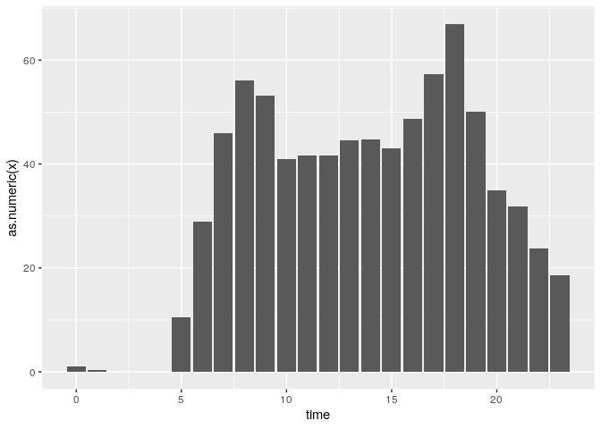
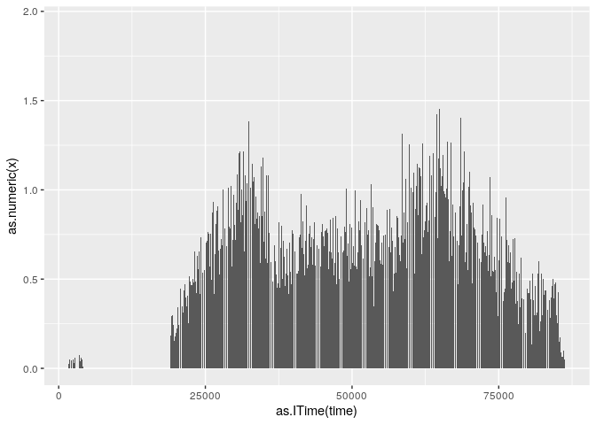
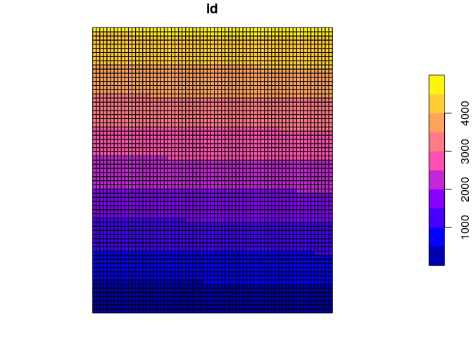
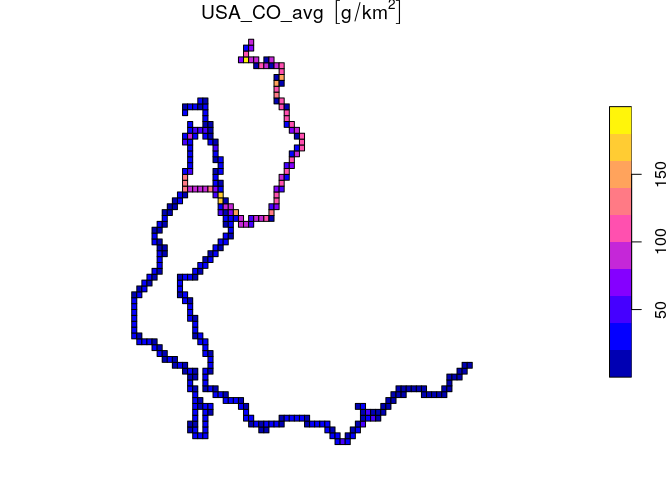

Introduction to GTFS2EMIS
================

### 1\) GTFS data

The estimation of hot exhaust emissions from GTFS data uses functions
from `gtfs2gps` package, as shown in the reproducible example below. The
main information used from this data is `speed` and distance `dist`.

``` r
library(gtfs2gps)
library(data.table)
library(gtfs2emis)
library(vein)
library(magrittr)
poa <- gtfs2gps::read_gtfs(system.file("extdata/poa.zip", package = "gtfs2gps"))
poa <- gtfs2gps::gtfs2gps(poa)
```

Input data dimensions can be simplified by using line segments
(`linestring` geometry type) instead of `points`, since the emissions
varies according to distance and speed.

``` r
poa_gpslines <- gtfs2gps::gps_as_sflinestring(poa)
object.size(poa) %>% format("Mb")
#> [1] "20.5 Mb"
dim(poa)
#> [1] 243449     14
object.size(poa_gpslines) %>% format("Mb")
#> [1] "18.7 Mb"
dim(poa_gpslines)
#> [1] 22560    12
```

### 2\) Fleet data

There are different types of fleet data that can be used for estimating
emissions.

#### Regional data

Data often obtained from registry of vehicles in local agencies of
transportation, which generally does not relate a certain vehicle
category (age and/or technology) to a specific route or shape in the
GTFS. In this situation, only a distribution of fleet is known, so the
inputs in each shape or route is given by a probability of distribution.
It considers that, on average, all vehicles has the same chance to
circulate in each route or
shape.

``` r
total_fleet <- data.table::data.table("2005"=1,"2010"=61,"2011"=50,"2012"=1,
                                     "2014"=45,"2015"=18,"2017"=62,"2018"=27,"2019"=31)
```

with probability of distribution based on frequency of `total_fleet`

``` r
 veh_distri <- as.numeric( total_fleet[1,]/sum(total_fleet[1,]) )
 veh_distri
#> [1] 0.003378378 0.206081081 0.168918919 0.003378378 0.152027027 0.060810811
#> [7] 0.209459459 0.091216216 0.104729730
 sum(veh_distri)
#> [1] 1
```

#### Detailed data

Used when the category of the vehicle is known for each route/shape of
GTFS.

``` r
det_fleet <- data.table::data.table("shape_id" = unique(poa$shapes$shape_id),
                                    "bus_age" = c("2010","2011","2012","2013"),
                                    "bus_fuel" = "Diesel")
```

### 3\) Emission factor

Emission factors functions is expressed in units `g/km`, and can be
speed-dependent according to emission factor data source. The avaliable
emissions factors are:

#### European emission factors for buses categories

Pollutants (g/km): CO, NOx, HC, PM, CH4, NMHC, CO2, SO2, Pb, FC ,NO,NO2.

``` r

euro_stage = c("II","IV","IV","V","V","V","V","V","V") # euro equivalent for brazilian fleet by years  
EF_europe <- ef_europe(vel = units::set_units(poa_gpslines$speed,'km/h'),
                          veh_type = "Urban Buses Standard 15 - 18 t",
                          tech = "SCR",
                          euro = euro_stage,
                          pol = "CO",aggregate = TRUE,
                          veh = veh_distri)
#> no technology associated with Euro II
head(EF_europe)
#>             CO_avg
#> 1: 1.860114 [g/km]
#> 2: 1.860114 [g/km]
#> 3: 1.860114 [g/km]
#> 4: 1.860114 [g/km]
#> 5: 1.860114 [g/km]
#> 6: 1.860114 [g/km]
```

#### United States emission factors for buses categories

Pollutants (g/km): CO, NOx, Hydrocarbons as TOG (total organic gases),
ROG (reactive organic gases), THC, CH4, PM10, PM2.5, SOx, CO2, N2O and
CH4.

``` r
EF_emfac <- gtfs2emis::ef_emfac(pol = "CO",calendar_year = "2019",
                                 model_year = colnames(total_fleet),
                                 speed = units::set_units(poa_gpslines$speed,'km/h'),
                                 veh = veh_distri,aggregate = TRUE,fuel = "Diesel")
head(EF_emfac)
#>               CO_avg
#> 1: 0.07509172 [g/km]
#> 2: 0.07509172 [g/km]
#> 3: 0.07509172 [g/km]
#> 4: 0.07509172 [g/km]
#> 5: 0.07509172 [g/km]
#> 6: 0.07509172 [g/km]
```

#### Brazil emission factors for buses

Pollutants: CO, HC, NMHC, CH4, NOx, CO2,RCHO, ETOH, PM, N2O, KML, FC,
NO2, NO, gD/KWH, gCO2/KWH, RCHO, CO\_0km, HC\_0km, NMHC\_0km, NOx\_0km,
NO2\_0km ,NO\_0km, RCHO\_0km and ETOH\_0km, FS (fuel sales) (g/km).
Obtained from `vein` package.

``` r
years <- c("2005","2010","2011","2012","2014","2015","2017","2018")

EF_cetesb <- sapply(seq_along(years),function(i){# i = colnames(total_fleet)[1]
  vein::ef_cetesb(p = "CO",veh = "BUS_URBAN_D",year = years[i],agemax = 1) * veh_distri[i]
}) %>% units::set_units("g/km") %>% sum()
EF_cetesb
#> 0.9235538 [g/km]
```

### 4\) Emission

Emissions are estimated as a product between distance (units `km`) with
emission factor (units
`g/km`).

#### Using different emission factors

``` r
data.table::setDT(poa_gpslines)[,emi_usa := units::set_units(poa_gpslines$dist,'km') * EF_emfac$CO_avg ]

poa_gpslines[,emi_europe :=  units::set_units(poa_gpslines$dist,'km') * EF_europe$CO_avg]
# not speed-dependent
poa_gpslines[,emi_cetesb := units::set_units(poa_gpslines$dist,'km') * EF_cetesb]
```

### 5\) Post-processing emissions

#### Hour time stamp

``` r
hour_post <- gtfs2emis::emis_post(emi = poa_gpslines$emi_usa,
                                  time = "hour",
                                  time_dt = poa_gpslines$departure_time)
library(ggplot2)
ggplot() + 
  geom_bar(data = hour_post,aes(x = time,y = as.numeric(x)),stat = "identity")
```

<!-- -->

#### Hour-minute time stamp

``` r
hour_post <- gtfs2emis::emis_post(emi = poa_gpslines$emi_usa,
                     time = "hour-minute",time_dt = poa_gpslines$departure_time)
library(ggplot2)
ggplot() + 
  geom_bar(data = hour_post,aes(x = time,y = as.numeric(x)),stat = "identity")
```

<!-- -->

#### Spatially

Make grid for visualize
emissions

``` r
grid_gps <- vein::make_grid(spobj = poa_gpslines,width =  0.25/102.47) #500 mts
#> Number of lon points: 67
#> Number of lat points: 69
plot(grid_gps["id"])
```

<!-- -->

Intersection operation

``` r
poa_sf <- sf::st_as_sf(poa_gpslines)
pol_gps <- vein::emis_grid(spobj = poa_sf["emi_usa"],g = grid_gps)
#> Your units are:
#> g
#> Sum of street emissions 784.92
#> Sum of gridded emissions 784.92
pol_gps <- pol_gps[as.numeric(pol_gps$emi_usa) > 0,]
plot(pol_gps["emi_usa"])
```

<!-- -->
